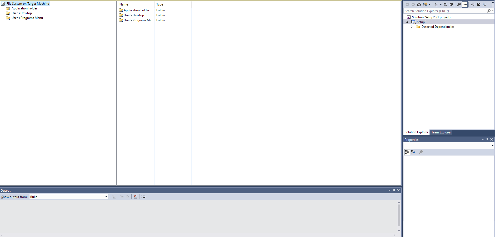

# Create Windows Installer
*Author: Jakkapan Jiranthorn*

##  Prerequisites
- [Visual Studio 2017](https://visualstudio.microsoft.com/downloads/)
- [Microsoft Visual Studio Installer Projects Extention](https://marketplace.visualstudio.com/items?itemName=VisualStudioClient.MicrosoftVisualStudio2017InstallerProjects) 
  
For Visual Studio 2015 use [Microsoft Visual Studio 2015 Installer Projects](https://marketplace.visualstudio.com/items?itemName=VisualStudioClient.MicrosoftVisualStudio2015InstallerProjects)

## Let's start

 1. Select project template, select "Setup Wizrd"

 
 2. Welcome screen,  click "Next"

 3. Select "Create a setup for a Window application" the click "Next"

 

 4. Optionally add file then click "Next" to see summary or click "Finish" to finish the initialization

 

 5. Workspace screen, drag and drop files and folders are available here.

 

 6. Right click to the setup package then click property

 

 7. Edit the properties of the installer

 8. After finished add files, folder, shortcuts, registries, build!

 

## References

- For Windows 10 [Package desktop applications (Desktop Bridge)](https://docs.microsoft.com/en-us/windows/uwp/porting/desktop-to-uwp-root)

- [Visual Studio Installer Deployment](https://docs.microsoft.com/en-us/previous-versions/visualstudio/visual-studio-2010/2kt85ked(v%3dvs.100))